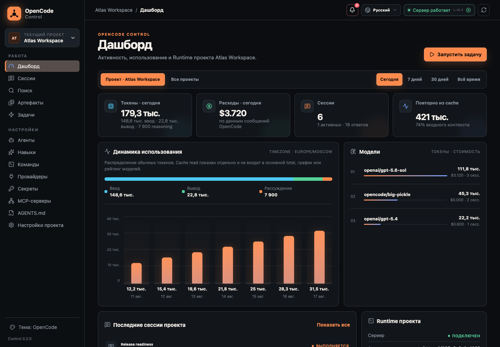
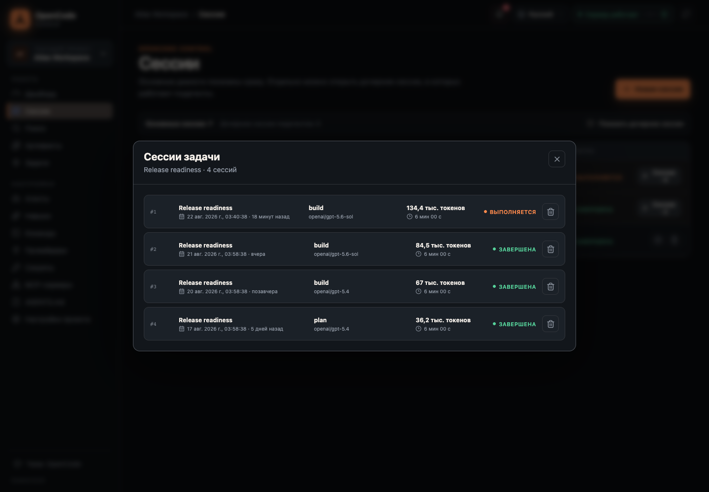
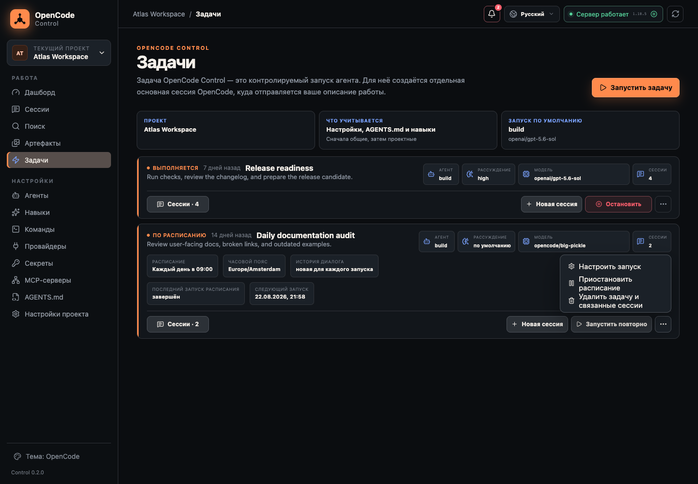
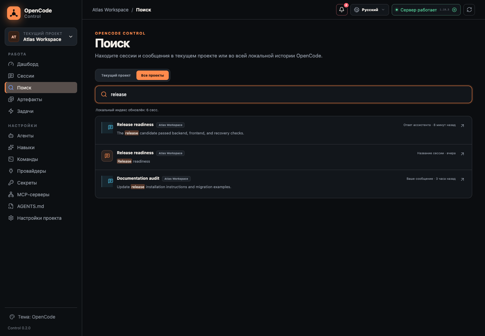
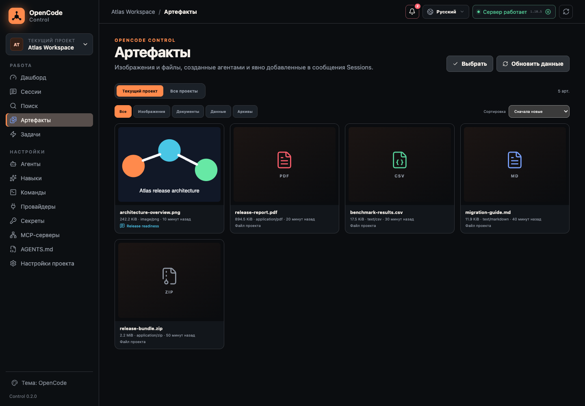
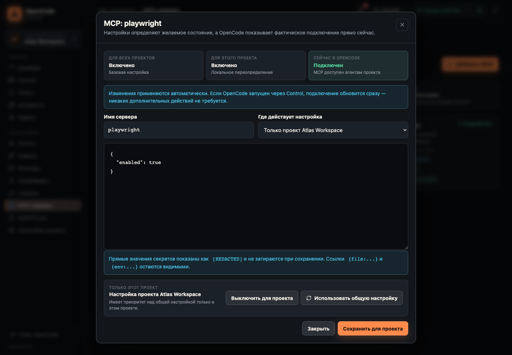
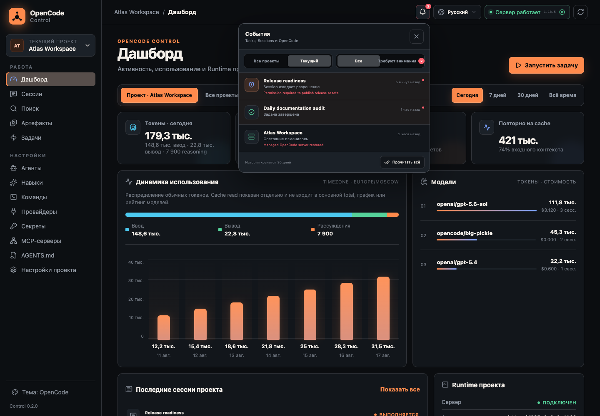
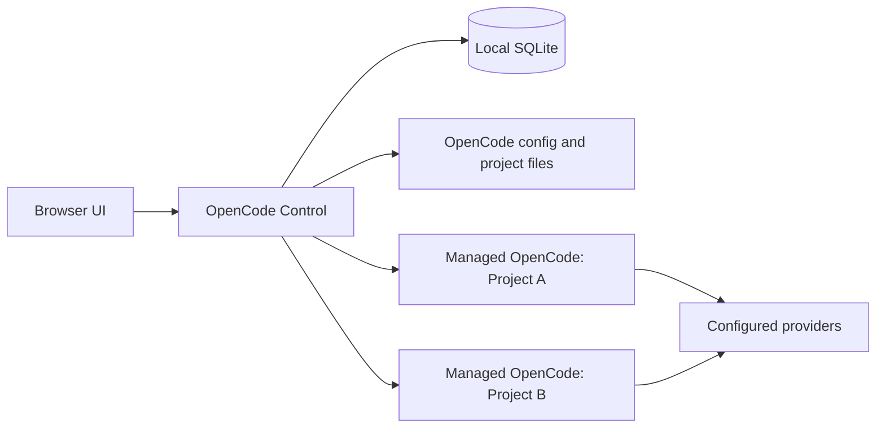

# OpenCode Control

<p align="center">
  <strong>Локальная control plane для проектов, агентов и автоматизации OpenCode.</strong><br>
  Управляйте рабочими пространствами, Sessions, Tasks, Skills, MCP, Git и артефактами
  из одного интерфейса, не заменяя OpenCode как execution engine.
</p>

<p align="center">
  <a href="README.md"><strong>Русский</strong></a> |
  <a href="README_en.md">English</a>
</p>

<p align="center">
  
  
  
  <a href="LICENSE"></a>
</p>



## Зачем нужен Control

OpenCode отлично выполняет агентные задачи. Control добавляет слой управления вокруг
него: несколько проектов, долгоживущие managed servers, история, расписания, безопасное
редактирование конфигурации и локальная аналитика.

- **Один интерфейс для нескольких проектов.** У каждого проекта свой runtime, Sessions,
  Tasks и project-level настройки.
- **Не только config editor.** Запускайте агентов, продолжайте диалоги, создавайте cron-задачи,
  управляйте Git и открывайте созданные файлы.
- **Локальные данные.** Control слушает только loopback, а состояние хранится на вашей машине.
- **OpenCode остаётся главным.** Agents, Skills, Commands, MCP и `AGENTS.md` остаются
  нативными файлами OpenCode и продолжают работать в TUI.
- **Безопасные изменения.** Config preflight, атомарная запись, rollback, redaction и
  восстановление после сбоев встроены в обычный workflow.

## Возможности

| Область | Что доступно |
| --- | --- |
| **Projects и Runtime** | Несколько локальных проектов, managed `opencode serve`, external loopback endpoints, автоматическое восстановление включённых серверов |
| **Sessions** | Чат, Markdown, tool calls, attachments, todos, permissions, agents, models, reasoning variants и дочерние subagent Sessions |
| **Tasks** | Управляемые запуски агентов, несколько Sessions на Task, rerun, abort, cron, timezone, pause/resume и история запусков |
| **Configuration** | Project/global Agents, Skills, Commands, MCP, providers, secrets, `AGENTS.md` и `opencode.json/jsonc` |
| **Dashboard** | Tokens, cache reuse, cost, Sessions и breakdown по моделям, providers, agents и проектам |
| **Search** | Локальный полнотекстовый поиск по названиям Sessions и user/assistant messages, global scope и permanent deep links |
| **Artifacts** | Images, PDF, CSV, JSON, Markdown, text, logs и ZIP; preview, Finder, bulk archive и системная Корзина |
| **Git** | Status, diff, stage/unstage, commit, revert и защищённый reset с backup branch |
| **Events** | Единый 30-дневный поток ошибок, завершений, permissions и server lifecycle с unread state |
| **Interface** | Русский и английский языки, desktop-навигация, темы и lazy-loaded экраны |

## Интерфейс

<table>
  <tr>
    <td width="50%">
      
      <br><strong>Sessions</strong>: сгруппированная история запусков Task, точные даты, статусы и usage.
    </td>
    <td width="50%">
      
      <br><strong>Tasks</strong>: ручные и запланированные запуски, сгруппированные Sessions и компактное меню действий.
    </td>
  </tr>
  <tr>
    <td width="50%">
      
      <br><strong>Search</strong>: поиск по локальной истории текущего или всех проектов.
    </td>
    <td width="50%">
      
      <br><strong>Artifacts</strong>: безопасный preview результатов агента без сканирования всего workspace.
    </td>
  </tr>
  <tr>
    <td colspan="2">
      
      <br><strong>MCP</strong>: отдельно показаны global config, project override и реальное состояние соединения в OpenCode.
    </td>
  </tr>
</table>



**Event Center**: permissions, завершения Tasks и восстановление runtime в едином desktop-потоке.

## Архитектура



Control не реализует собственный agent runtime. Он запускает или подключает OpenCode,
вызывает его API и сохраняет только собственное orchestration-состояние, индексы и события.

## Требования

- macOS или Linux;
- [`uv`](https://docs.astral.sh/uv/) с доступным Python 3.12;
- Node.js и npm для сборки текущей alpha-версии;
- OpenCode CLI в `PATH` для managed project servers.

External OpenCode endpoint можно подключить и без локального CLI, но Control не будет
управлять жизненным циклом чужого процесса.

## Установка

```bash
git clone https://github.com/Enzzo657/Opencode-Control.git OpenCode-Control
cd OpenCode-Control
./install.sh
```

Installer:

1. устанавливает frontend-зависимости через `npm ci`;
2. собирает frontend и Python wheel;
3. устанавливает `opencode-control` в отдельное окружение через `uv tool`;
4. запускает Control и открывает `http://127.0.0.1:8765`.

Node.js нужен только для сборки. Установленный Control запускается без Node.js.

Если команда не появилась в новом Terminal:

```bash
uv tool update-shell
```

## Быстрый старт

1. Запустите `opencode-control start`.
2. Добавьте директорию проекта через переключатель в sidebar.
3. Нажмите **Запустить сервер** для managed mode или задайте external loopback endpoint.
4. Откройте **Sessions** для диалога или **Tasks** для управляемого запуска.
5. Настройте project/global Agents, Skills, Commands, MCP и инструкции при необходимости.

Managed server читает global OpenCode config, затем project config выбранного workspace.
Project-файлы остаются обычными файлами репозитория и могут храниться в Git.

## Основные сценарии

### Sessions и Tasks

Control показывает основные и дочерние Sessions отдельно, умеет продолжать диалог,
останавливать активный run и отвечать на permission requests. В prompt можно выбрать
agent, `provider/model`, reasoning variant, Slash Command, `@subagent` и вложения.

Task создаёт управляемую основную Session и может владеть несколькими независимыми
Sessions. Расписание задаётся понятным конструктором или cron-выражением с IANA timezone.
Каждый запуск может создавать новую Session или продолжать предыдущую.

При неопределённом результате отправки Control сохраняет состояние `ambiguous` и не
делает blind retry. Это предотвращает скрытый повтор внешней агентной работы.

### Agents, Skills и Commands

- Agents: project/global scope, mode, model, permissions и prompt.
- Skills: ручное создание, HTTPS/GitHub import с preview, commit pinning и bundle manifest.
- Commands: нативные Markdown Slash Commands с `$ARGUMENTS`, `$1`, agent/model/variant.
- Instructions: project и global `AGENTS.md`.

При добавлении проекта Control создаёт редактируемые стартовые команды `/fix`, `/test`,
`/plan`, `/explain` и `/commit-check`, не перезаписывая существующие файлы.

### MCP, providers и secrets

Для MCP одновременно видны три состояния:

- **global**: базовая конфигурация для всех проектов;
- **project**: локальная настройка или override;
- **runtime**: реальное состояние соединения в запущенном OpenCode.

Изменения проходят проверку реальным `opencode --pure debug config`, записываются
атомарно и перезапускают только ранее работавшие managed servers. При ошибке исходные
файлы восстанавливаются byte-for-byte.

Secrets хранятся в отдельных plaintext-файлах с mode `0600`. Их значения не возвращаются
в browser API; конфигурация использует ссылки `{file:...}` или `{env:...}`.
Runtime access token также хранится локально с mode `0600`, передаётся браузеру только
во fragment URL и после авторизации остаётся в `HttpOnly` cookie.

### Search и Artifacts

Search поддерживает project/global scope, ranked pagination, `Cmd+K` / `Ctrl+K` и deep
links к конкретному сообщению. Индексируются только titles и текст user/assistant messages;
tool output, reasoning и attachments не копируются в индекс.

Artifacts собирает файлы, явно упомянутые агентом, и содержимое `.opencode/artifacts`.
Весь project root намеренно не сканируется. Traversal, symlink, hard-link и неподходящие
сигнатуры файлов отклоняются.

## CLI

| Команда | Назначение |
| --- | --- |
| `opencode-control start` | Запустить Control в фоне и открыть браузер |
| `opencode-control start --no-open` | Запустить без открытия браузера |
| `opencode-control restart` | Перезапустить Control и включённые managed servers |
| `opencode-control stop` | Остановить Control и managed servers |
| `opencode-control status` | Показать состояние Control |
| `opencode-control logs --follow` | Читать runtime log |
| `opencode-control soak --cycles 1000` | Запустить изолированный scheduler/recovery stress pass |
| `opencode-control uninstall` | Удалить приложение, сохранив данные |
| `opencode-control uninstall --purge-data` | Удалить приложение и данные после подтверждения |

## Безопасность и данные

- HTTP server принимает только loopback host/client/origin.
- Runtime access token выдаёт доступ API только браузеру, открытому через CLI.
- Write API защищён browser session и CSRF token.
- Managed OpenCode servers используют случайный пароль и недоступны как общий backend.
- Project-файлы открываются через descriptor-relative операции с проверкой root identity.
- Config и workspace writes атомарны; незавершённые транзакции восстанавливаются при старте.
- Логи и ошибки проходят redaction известных credentials, headers, cookies и URL values.
- Preview не публикует произвольный filesystem и не распаковывает ZIP.

| Данные | Путь |
| --- | --- |
| Control SQLite, registry и logs | `~/.opencode-control/` |
| Global OpenCode config | `~/.config/opencode/` |
| OpenCode history | `~/.local/share/opencode/` |
| Project Agents, Skills, Commands | `<project>/.opencode/` |

Каталог Control можно изменить через `OPENCODE_CONTROL_HOME`.

### Backup

```bash
opencode-control stop
cp ~/.opencode-control/control.sqlite ~/opencode-control-backup.sqlite
opencode-control start
```

Project-файлы и global OpenCode config резервируются отдельно.

## Ограничения alpha

- Поддерживаются macOS и Linux; Windows пока не поддерживается.
- API доступен только локально и защищён отдельным runtime access token.
- Secrets защищены filesystem permissions, но не зашифрованы и не используют OS keychain.
- Exactly-once dispatch невозможен без idempotency key в OpenCode API.
- Plugins Manager отложен: plugin является исполняемым JS/TS-кодом и требует отдельной security model.
- Системные desktop notifications не используются; события остаются внутри Control.
- Текущая alpha устанавливается из клонированного репозитория.

## Разработка

```bash
uv sync --extra dev
npm ci --prefix web
npm run build --prefix web
uv run uvicorn opencode_control.app:create_app --host 127.0.0.1 --port 8765
```

Проверки:

```bash
uv run ruff check src tests
uv run mypy
uv run pytest
npm run lint --prefix web
npm run typecheck --prefix web
npm run test --prefix web
npm run build --prefix web
```

## Лицензия

[MIT](LICENSE)

История выпусков: [CHANGELOG.md](CHANGELOG.md).
