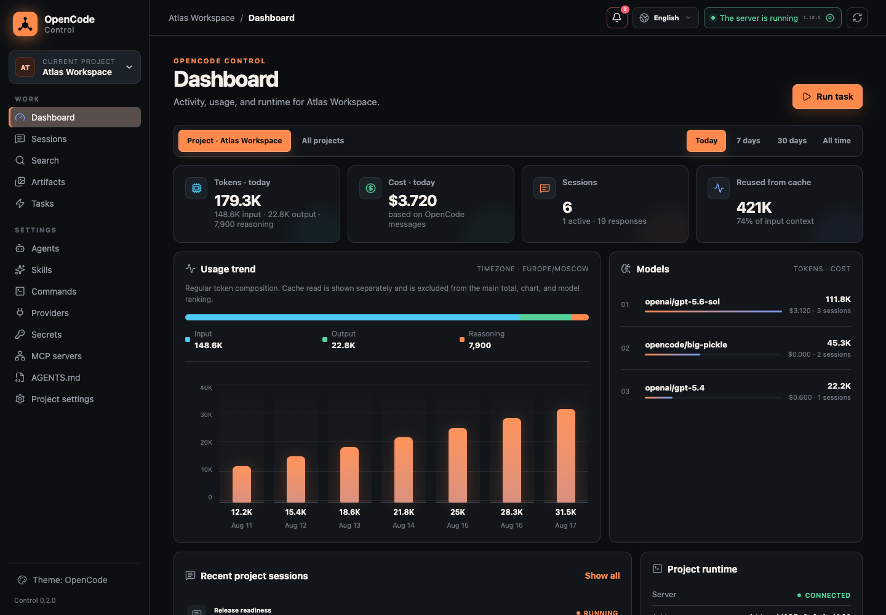
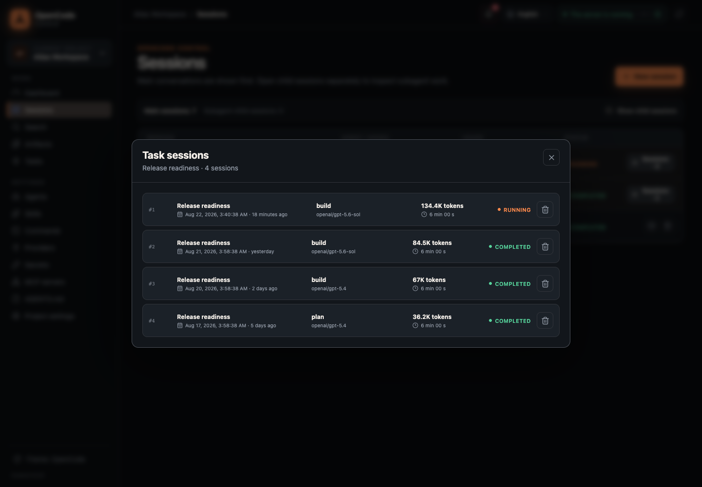
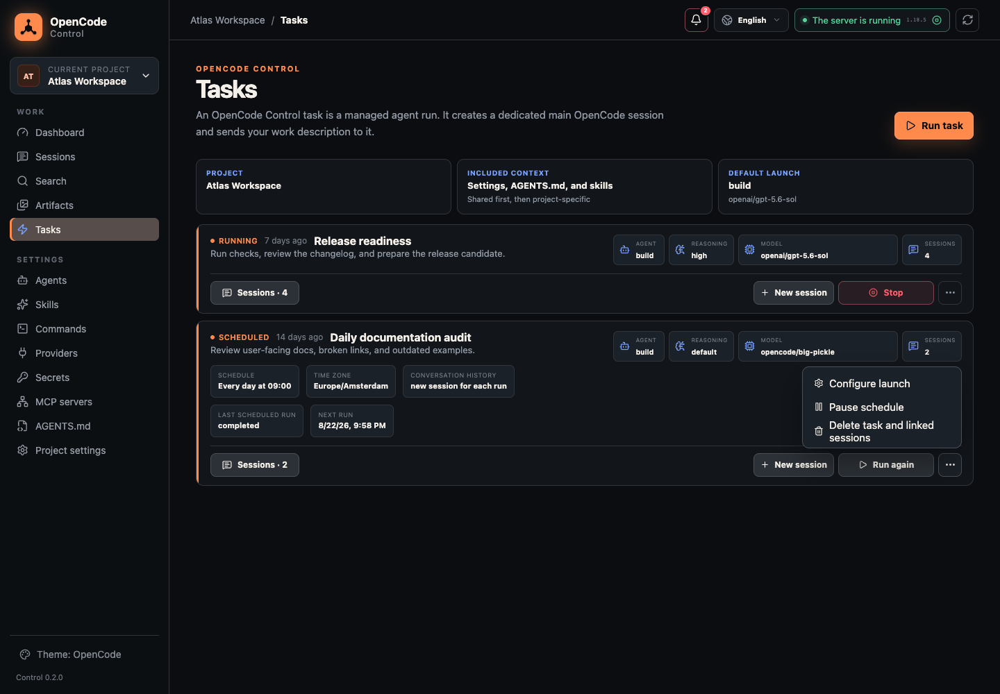
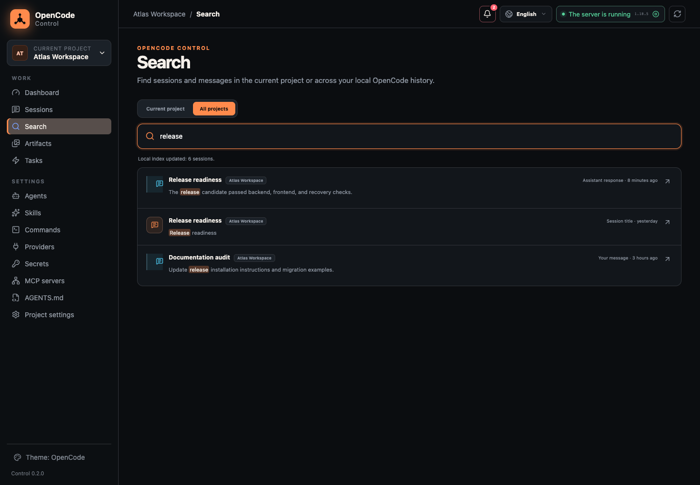
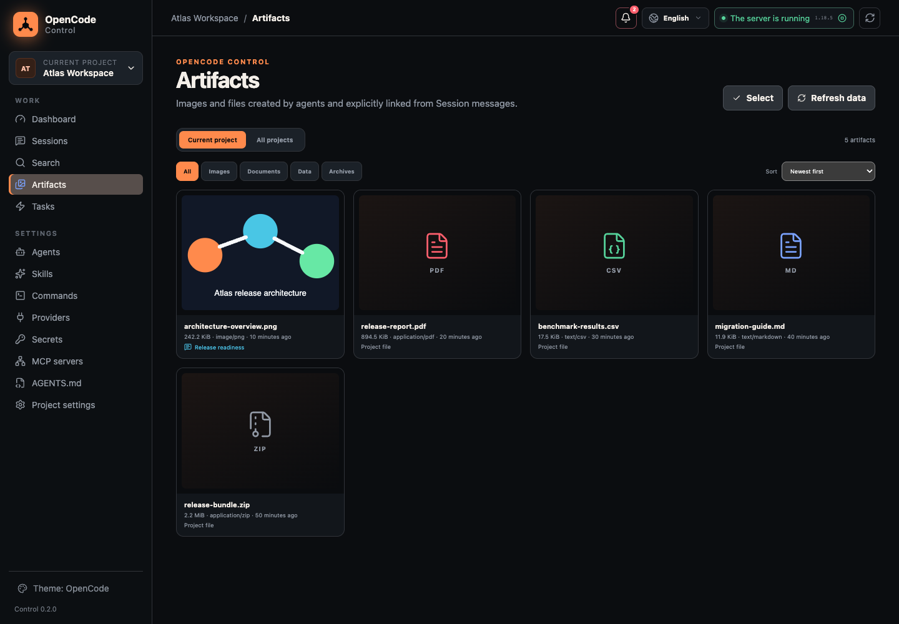
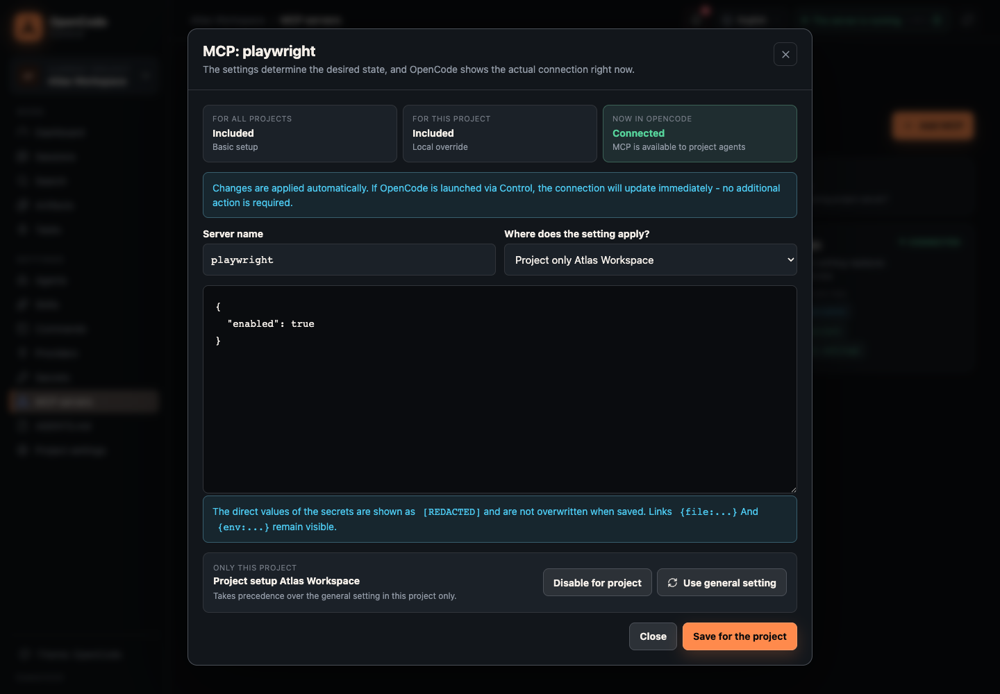
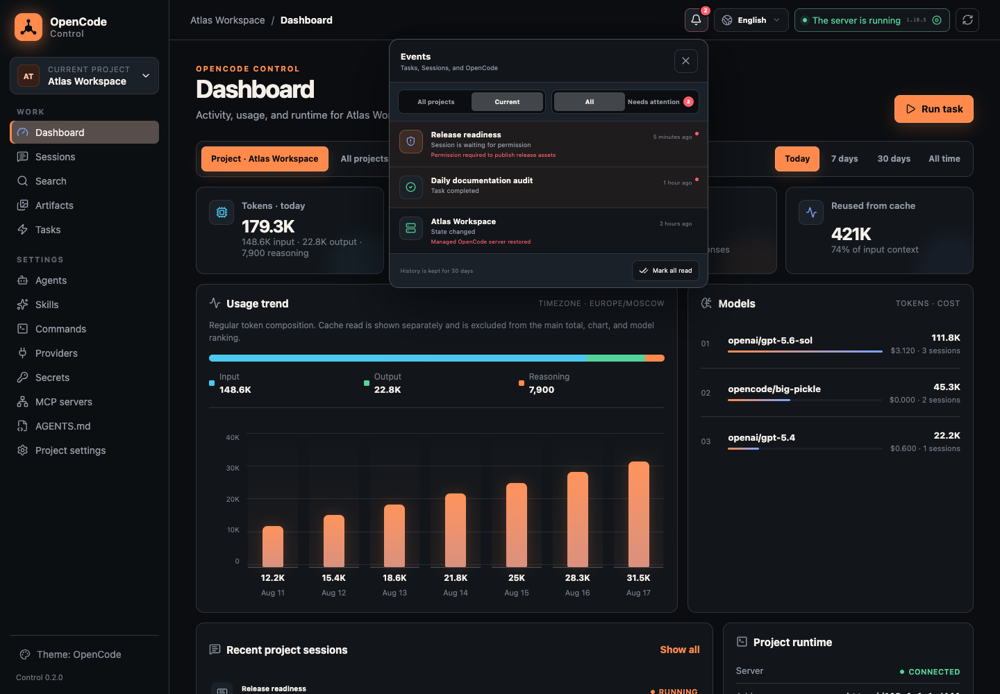
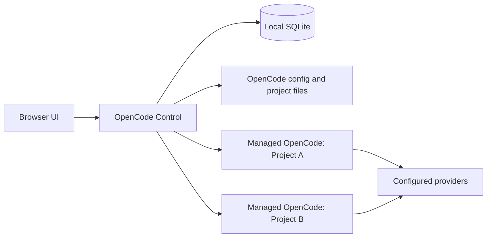

# OpenCode Control

<p align="center">
  <strong>A local control plane for OpenCode projects, agents, and automation.</strong><br>
  Manage workspaces, Sessions, Tasks, Skills, MCP, Git, and artifacts in one interface
  while OpenCode remains the execution engine.
</p>

<p align="center">
  <a href="README.md">Русский</a> |
  <a href="README_en.md"><strong>English</strong></a>
</p>

<p align="center">
  
  
  
  <a href="LICENSE"></a>
</p>



## Why Control

OpenCode is excellent at executing agentic work. Control adds an operational layer around
it: multiple projects, long-lived managed servers, history, schedules, safe configuration
editing, and local analytics.

- **One interface for multiple projects.** Each project gets its own runtime, Sessions,
  Tasks, and project-level configuration.
- **More than a config editor.** Run agents, continue conversations, schedule recurring work,
  manage Git, and inspect generated files.
- **Local data.** Control listens on loopback only and keeps its state on your machine.
- **OpenCode stays in charge.** Agents, Skills, Commands, MCP, and `AGENTS.md` remain native
  OpenCode files and continue to work in the TUI.
- **Safer changes.** Config preflight, atomic writes, rollback, redaction, and crash recovery
  are part of the normal workflow.

## Capabilities

| Area | What you get |
| --- | --- |
| **Projects and Runtime** | Multiple local projects, managed `opencode serve`, external loopback endpoints, and automatic restoration of enabled servers |
| **Sessions** | Chat, Markdown, tool calls, attachments, todos, permissions, agents, models, reasoning variants, and child subagent Sessions |
| **Tasks** | Managed agent runs, multiple Sessions per Task, rerun, abort, cron, timezone, pause/resume, and run history |
| **Configuration** | Project/global Agents, Skills, Commands, MCP, providers, secrets, `AGENTS.md`, and `opencode.json/jsonc` |
| **Dashboard** | Tokens, cache reuse, cost, Sessions, and breakdowns by model, provider, agent, and project |
| **Search** | Local full-text search over Session titles and user/assistant messages, global scope, and permanent deep links |
| **Artifacts** | Images, PDF, CSV, JSON, Markdown, text, logs, and ZIP; preview, Finder, bulk archive, and system Trash |
| **Git** | Status, diff, stage/unstage, commit, revert, and guarded reset with a backup branch |
| **Events** | A unified 30-day stream of failures, completions, permissions, and server lifecycle events with unread state |
| **Interface** | English and Russian, desktop navigation, themes, and lazy-loaded screens |

## Interface

<table>
  <tr>
    <td width="50%">
      
      <br><strong>Sessions</strong>: grouped Task run history with exact timestamps, status, and usage.
    </td>
    <td width="50%">
      
      <br><strong>Tasks</strong>: manual and scheduled runs, grouped Sessions, and a compact action menu.
    </td>
  </tr>
  <tr>
    <td width="50%">
      
      <br><strong>Search</strong>: query local history in the current project or across every project.
    </td>
    <td width="50%">
      
      <br><strong>Artifacts</strong>: safely preview agent output without scanning the entire workspace.
    </td>
  </tr>
  <tr>
    <td colspan="2">
      
      <br><strong>MCP</strong>: global config, project override, and the live OpenCode connection are shown separately.
    </td>
  </tr>
</table>



**Event Center**: permissions, Task completions, and runtime recovery in one desktop feed.

## Architecture



Control does not implement another agent runtime. It launches or connects to OpenCode,
uses its API, and persists only its own orchestration state, indexes, and events.

## Requirements

- macOS or Linux;
- [`uv`](https://docs.astral.sh/uv/) with Python 3.12 available;
- Node.js and npm to build the current alpha;
- OpenCode CLI in `PATH` for managed project servers.

You can attach an external OpenCode endpoint without the local CLI, but Control will not
manage the lifecycle of that process.

## Installation

```bash
git clone https://github.com/Enzzo657/Opencode-Control.git OpenCode-Control
cd OpenCode-Control
./install.sh
```

The installer:

1. installs frontend dependencies with `npm ci`;
2. builds the frontend and Python wheel;
3. installs `opencode-control` into an isolated `uv tool` environment;
4. starts Control and opens `http://127.0.0.1:8765`.

Node.js is only needed for the build. The installed Control runtime does not require it.

If the command is not available in a new terminal:

```bash
uv tool update-shell
```

## Quick Start

1. Run `opencode-control start`.
2. Add a project directory from the sidebar project switcher.
3. Click **Start server** for managed mode or configure an external loopback endpoint.
4. Open **Sessions** for a conversation or **Tasks** for a managed run.
5. Configure project/global Agents, Skills, Commands, MCP, and instructions as needed.

A managed server reads the global OpenCode configuration first and then the project
configuration for the selected workspace. Project resources stay as ordinary repository
files and can be versioned with Git.

## Core Workflows

### Sessions and Tasks

Control separates main and child Sessions, continues conversations, aborts active runs,
and answers permission requests. A prompt can select an agent, `provider/model`, reasoning
variant, Slash Command, `@subagent`, and attachments.

A Task creates a managed main Session and can own multiple independent Sessions. Schedules
use a friendly builder or a cron expression with an IANA timezone. Each occurrence can start
a fresh Session or reuse the previous conversation.

When dispatch has an uncertain outcome, Control stores `ambiguous` instead of retrying
blindly. This prevents hidden duplication of external agent work.

### Agents, Skills, and Commands

- Agents: project/global scope, mode, model, permissions, and prompt.
- Skills: manual creation or HTTPS/GitHub import with preview, commit pinning, and a bundle manifest.
- Commands: native Markdown Slash Commands with `$ARGUMENTS`, `$1`, agent/model/variant.
- Instructions: project and global `AGENTS.md`.

When a project is added, Control creates editable `/fix`, `/test`, `/plan`, `/explain`, and
`/commit-check` starter Commands without overwriting existing files.

### MCP, Providers, and Secrets

MCP presents three different states at the same time:

- **global**: the base configuration for every project;
- **project**: a local setting or override;
- **runtime**: the actual connection state inside the running OpenCode server.

Changes are validated with real `opencode --pure debug config`, written atomically, and
restart only previously running managed servers. On failure, original files are restored
byte-for-byte.

Secrets are plaintext files with mode `0600`. Their values are never returned through the
browser API; configuration uses `{file:...}` or `{env:...}` references.
The runtime access token is also stored locally with mode `0600`, reaches the browser only
through a URL fragment, and remains in an `HttpOnly` cookie after authorization.

### Search and Artifacts

Search supports project/global scope, ranked pagination, `Cmd+K` / `Ctrl+K`, and deep links
to an exact message. Only titles and user/assistant text are indexed; tool output, reasoning,
and attachments are not copied into the index.

Artifacts collects files explicitly referenced by agents and files inside
`.opencode/artifacts`. It intentionally does not scan the entire project root. Traversal,
symlinks, hard links, and mismatched file signatures are rejected.

## CLI

| Command | Purpose |
| --- | --- |
| `opencode-control start` | Start Control in the background and open the browser |
| `opencode-control start --no-open` | Start without opening the browser |
| `opencode-control restart` | Restart Control and enabled managed servers |
| `opencode-control stop` | Stop Control and managed servers |
| `opencode-control status` | Show Control status |
| `opencode-control logs --follow` | Follow the runtime log |
| `opencode-control soak --cycles 1000` | Run an isolated scheduler/recovery stress pass |
| `opencode-control uninstall` | Remove the application and preserve data |
| `opencode-control uninstall --purge-data` | Remove the application and data after confirmation |

## Security and Data

- The HTTP server accepts loopback host, client, and origin only.
- A runtime access token grants API access only to a browser opened through the CLI.
- Write APIs require a browser session and CSRF token.
- Managed OpenCode servers use a random password and are not exposed as a shared backend.
- Project files use descriptor-relative operations guarded by root identity checks.
- Config and workspace writes are atomic; incomplete transactions recover on startup.
- Logs and errors redact known credentials, headers, cookies, and URL values.
- Preview routes never expose arbitrary filesystem paths or extract ZIP archives.

| Data | Location |
| --- | --- |
| Control SQLite, registry, and logs | `~/.opencode-control/` |
| Global OpenCode config | `~/.config/opencode/` |
| OpenCode history | `~/.local/share/opencode/` |
| Project Agents, Skills, and Commands | `<project>/.opencode/` |

Override the Control data directory with `OPENCODE_CONTROL_HOME`.

### Backup

```bash
opencode-control stop
cp ~/.opencode-control/control.sqlite ~/opencode-control-backup.sqlite
opencode-control start
```

Back up project resources and global OpenCode configuration separately.

## Alpha Limitations

- macOS and Linux are supported; Windows is not supported yet.
- The API is local-only and protected by a dedicated runtime access token.
- Secrets rely on filesystem permissions and are not encrypted or stored in an OS keychain.
- Exactly-once dispatch is impossible without an idempotency key in the OpenCode API.
- Plugins Manager is deferred because plugins are executable JS/TS and need a separate security model.
- There are no system desktop notifications; events stay inside Control.
- The current alpha is installed from a cloned repository.

## Development

```bash
uv sync --extra dev
npm ci --prefix web
npm run build --prefix web
uv run uvicorn opencode_control.app:create_app --host 127.0.0.1 --port 8765
```

Checks:

```bash
uv run ruff check src tests
uv run mypy
uv run pytest
npm run lint --prefix web
npm run typecheck --prefix web
npm run test --prefix web
npm run build --prefix web
```

## License

[MIT](LICENSE)

Release history: [CHANGELOG.md](CHANGELOG.md).
